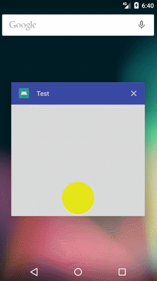
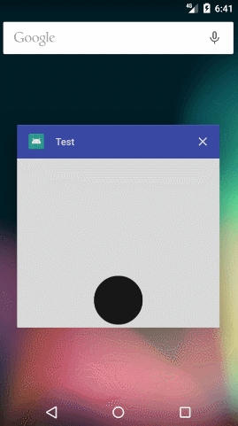

# AndroidFeelView
一个仿掘金广告页‘跳过’按钮的动画






- 添加依赖：

Step 1. Add the JitPack repository to your build file

Add it in your root build.gradle at the end of repositories:

```
allprojects {
		repositories {
			...
			maven { url 'https://www.jitpack.io' }
		}
	}
```

Step 2. Add the dependency

```
dependencies {
	       compile 'com.github.funnyzhaov:AndroidFeelView:1.0.2'
	}
```

- xml中引用
```xml
 <me.funnyzhao.feelview.RotatingSkip
       app:angleOffset="5"
       app:bgColor="#ff55ff"
       android:layout_width="60dp"
       android:layout_height="60dp" />
```

angleOffset:默认为2、值越大，速度越快 <=10

bgColor:用来设置旋转和圆的颜色 ,默认为#000


- java代码中

```java
mSkipView=(RotatingSkip) findViewById(R.id.loding);
        mSkipView.setLoadingListener(new RotatingSkip.LoadingListener() {
            @Override
            public void loadingFinish() {
                //这里响应动画完成时的操作
            }
        });
```

Thanks.

by funnyzhao.
